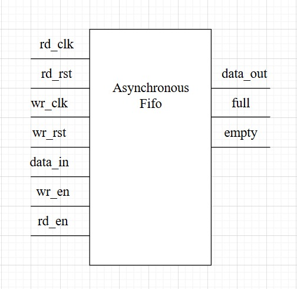
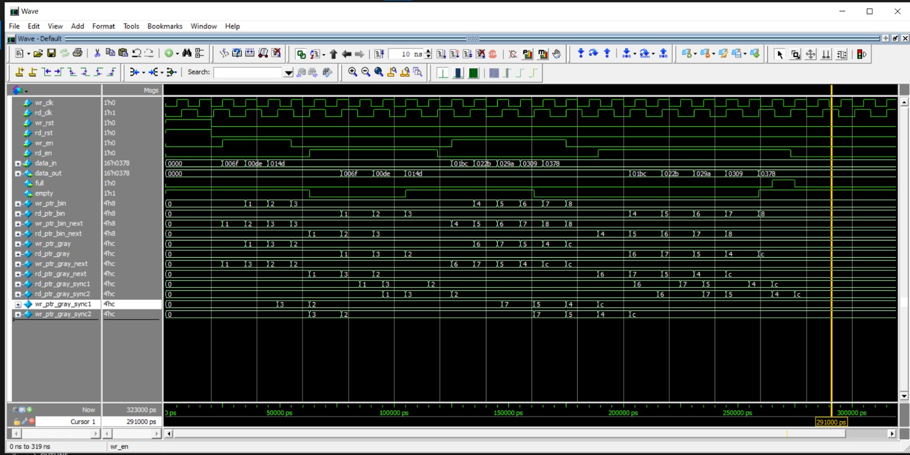
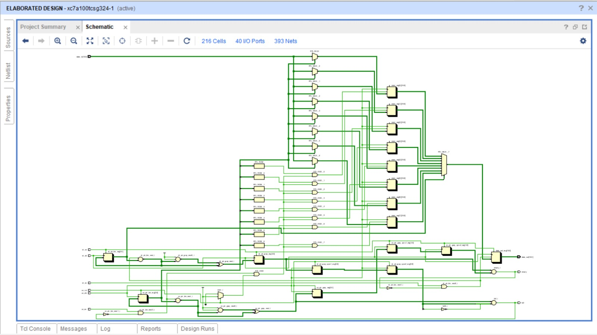

#  Asynchronous FIFO 

##  Problem Statement

When two subsystems in digital design (for example, a **producer** and a **consumer**) run on **different clocks**, data transfer becomes unsafe due to **clock domain crossing (CDC)**.
Directly passing data may cause:

* **Metastability**
* **Data loss or corruption**
* **Setup/hold time violations**

To solve this, we need a **safe buffer** that:

* Can store data temporarily
* Allows one side to **write** and the other side to **read** at **different clock rates**
* Uses synchronization techniques to handle CDC issues

---

### Top module

##  Solution

This module implements an **Asynchronous FIFO**:

* **Write side** uses `wr_clk`
* **Read side** uses `rd_clk`
* Uses **binary pointers** for indexing memory
* Converts pointers to **Gray code** to safely synchronize across clock domains
* Detects **Full** and **Empty** conditions correctly

---

##  Features

* Parameterized design:

  * `DATA_WIDTH` → width of each data word (default 16 bits)
  * `FIFO_DEPTH` → number of entries (default 8)
* Safe **clock domain crossing** using Gray code synchronization
* Handles **reset** for both write and read domains
* Provides:

  * `full` flag → stops writes when FIFO is full
  * `empty` flag → stops reads when FIFO is empty

---

##  Module I/O

### Inputs

* `wr_clk` → Write clock
* `rd_clk` → Read clock
* `wr_rst` → Write domain reset
* `rd_rst` → Read domain reset
* `wr_en` → Write enable (valid data written if FIFO not full)
* `rd_en` → Read enable (valid data read if FIFO not empty)
* `data_in` → Input data (to be written into FIFO)

### Outputs

* `data_out` → Data read from FIFO
* `full` → Indicates FIFO cannot accept more data
* `empty` → Indicates FIFO has no data to read

---

##  Working Principle

1. **Write Side**

   * Data is written into memory (`mem`) at `wr_ptr_bin` index.
   * Write pointer increments when `wr_en && !full`.
   * Binary pointer → converted to Gray code → synchronized to read domain.

2. **Read Side**

   * Data is read from memory at `rd_ptr_bin` index.
   * Read pointer increments when `rd_en && !empty`.
   * Binary pointer → converted to Gray code → synchronized to write domain.

3. **Full / Empty Conditions**

   * **Empty** → Read and Write Gray pointers are equal.
   * **Full** → Next Write Gray pointer = Read Gray pointer with MSB inverted.

---

### Testbench verification

### Vivado simulation

